# UI Styles & Visual Themes Skill

This skill guides the AI agent in selecting, generating, and implementing 22 distinct visual UI styles and design themes. It bridges the gap between high-level aesthetic intent and production-ready CSS/Tailwind code, providing precise design tokens, component templates, and usability safeguards.

---

## 1. The 5 Aesthetic Archetypes

Before styling, identify the visual mood and product category to pick the ideal style:

```mermaid
graph TD
    Root[UI Aesthetic Archetypes] --> Dimensional[1. Dimensional & Tactile]
    Root --> Modernist[2. Graphic & Modernist]
    Root --> Retro[3. Retro & Nostalgic]
    Root --> Futuristic[4. High-Tech & Futuristic]
    Root --> Artistic[5. Artistic & Organic]

    Dimensional --> C1[Claymorphism]
    Dimensional --> C2[Neumorphism]
    Dimensional --> C3[Glassmorphism]

    Modernist --> M1[Neo-Brutalism]
    Modernist --> M2[Swiss Design]
    Modernist --> M3[Minimalism]
    Modernist --> M4[Maximalism]
    Modernist --> M5[Editorial Design]
    Modernist --> M6[Bento Grid]

    Retro --> R1[Y2K Aesthetic]
    Retro --> R2[Pixel Art]
    Retro --> R3[Synthwave]
    Retro --> R4[Victorian]

    Futuristic --> F1[Cybercore]
    Futuristic --> F2[Cyberpunk]

    Artistic --> A1[Scrapbook]
    Artistic --> A2[Surrealism]
    Artistic --> A3[Conceptual Sketch]
    Artistic --> A4[Ethereal]
    Artistic --> A5[Bohemian]
    Artistic --> A6[Luxury Typography]
    Artistic --> A7[Wabi-Sabi]
```



---

## 2. Master Style Directory (22 Styles)

### 1. Claymorphism
* **Visual DNA**: 3D puffy, inflated clay-like shapes with soft multi-layered inner and drop shadows. Friendly, tactile, and playful.
* **Palette**: Pastel primaries, soft mint, bubblegum pink, lavender, warm marshmallow white backgrounds.
* **CSS Recipe**:
  ```css
  background: #f0f3f8;
  border-radius: 24px;
  box-shadow: 12px 12px 24px #d1d9e6, -12px -12px 24px #ffffff,
              inset -6px -6px 12px rgba(0, 0, 0, 0.08), inset 6px 6px 12px rgba(255, 255, 255, 0.9);
  ```
* **Best For**: Gamified apps, educational tools, child-friendly products, onboarding steps.
* **Avoid When**: Data-dense enterprise dashboards, financial terminals.

---

### 2. Cybercore
* **Visual DNA**: Technical wireframes, HUD overlays, coordinates, monospaced data readouts, thin geometric lines, modular crosshairs.
* **Palette**: Deep slate/pitch black (`#0a0b0e`), phosphor cyan (`#00f0ff`), tactical olive (`#506040`), stark white.
* **CSS Recipe**:
  ```css
  background: #0d0f14;
  border: 1px solid rgba(0, 240, 255, 0.3);
  font-family: 'JetBrains Mono', 'Fira Code', monospace;
  box-shadow: inset 0 0 15px rgba(0, 240, 255, 0.05);
  ```
* **Best For**: Dev tools, terminal interfaces, gaming overlays, Web3/crypto telemetry.
* **Avoid When**: Casual e-commerce, lifestyle blogs.

---

### 3. Neo-Brutalism
* **Visual DNA**: Unapologetic raw contrast, thick solid black borders (`2px - 4px`), hard offset drop shadows with zero blur, vibrant saturated blocks.
* **Palette**: Canary yellow (`#FFDE59`), safety orange (`#FF6B6B`), electric cyan (`#4DEEEA`), crisp white, pitch black (`#000000`).
* **CSS Recipe**:
  ```css
  background: #fff;
  border: 3px solid #000;
  border-radius: 8px; /* or 0px */
  box-shadow: 5px 5px 0px #000;
  transition: transform 0.1s ease, box-shadow 0.1s ease;
  ```
  *Hover State*: `transform: translate(2px, 2px); box-shadow: 3px 3px 0px #000;`
* **Best For**: Modern SaaS marketing, design portfolios, Gen-Z fintech, productivity apps (e.g., Gumroad style).
* **Avoid When**: Conservative enterprise software, healthcare.

---

### 4. Scrapbook
* **Visual DNA**: Tactile collage, paper cutouts, realistic scotch tape, postage stamps, hand-drawn annotations, Polaroid frames, slight element rotation (`rotate(-2deg)`).
* **Palette**: Craft cardboard beige (`#F4ECE1`), newsprint cream (`#FFFDF9`), ink black, washi tape pastels.
* **CSS Recipe**:
  ```css
  background: #fffdfa;
  border: 1px solid #e2dac9;
  transform: rotate(-1.5deg);
  box-shadow: 2px 4px 12px rgba(0, 0, 0, 0.08);
  filter: drop-shadow(1px 2px 1px rgba(0,0,0,0.05));
  ```
* **Best For**: Creative portfolios, moodboards, storytelling blogs, event invitations.
* **Avoid When**: High-efficiency workflows, multi-step transaction funnels.

---

### 5. Surrealism
* **Visual DNA**: Dreamlike disorientation, impossible spatial depth, floating objects, unexpected scale, trompe-l'œil shadows, artistic gradients.
* **Palette**: Deep midnight blue, sunset cadmium, twilight purple, glowing amber accents.
* **CSS Recipe**:
  ```css
  background: radial-gradient(circle at 50% 20%, #2e1a47, #0d0814);
  perspective: 1000px;
  filter: drop-shadow(0 20px 30px rgba(110, 40, 200, 0.3));
  ```
* **Best For**: High-concept luxury fashion, music albums, interactive art showcases.
* **Avoid When**: Standard utility applications, forms.

---

### 6. Y2K Aesthetic
* **Visual DNA**: Early 2000s cyber-optimism, glossy candy buttons, chrome metallic reflections, starburst decals, bubble typography, iridescent sheen.
* **Palette**: Bubblegum pink (`#FF72B6`), chrome silver, lime green (`#98EECC`), cyan, icy translucent blue.
* **CSS Recipe**:
  ```css
  background: linear-gradient(180deg, #ffffff 0%, #e2e8f0 50%, #cbd5e1 100%);
  border: 2px solid #fff;
  border-radius: 9999px;
  box-shadow: 0 4px 10px rgba(0, 180, 255, 0.3), inset 0 2px 4px rgba(255, 255, 255, 0.8);
  ```
* **Best For**: Music platforms, streetwear fashion, retro games, youth-oriented entertainment.
* **Avoid When**: B2B enterprise apps, legal or financial platforms.

---

### 7. Pixel Art
* **Visual DNA**: 8-bit/16-bit retro arcade aesthetic, visible raster grid, hard pixelated borders, step transitions, bitmap fonts.
* **Palette**: Authentic retro palette (NES/GameBoy/PICO-8: 16–32 restricted colors).
* **CSS Recipe**:
  ```css
  font-family: '"Press Start 2P"', monospace;
  image-rendering: pixelated;
  box-shadow: 4px 0 #000, -4px 0 #000, 0 -4px #000, 0 4px #000; /* Pixel border */
  ```
* **Best For**: Retro gaming sites, indie dev hubs, developer easter eggs, Web3 community pages.
* **Avoid When**: Long-form reading, accessibility-sensitive utilities.

---

### 8. Synthwave
* **Visual DNA**: 1980s neon retrowave, receding perspective wireframe grids, digital neon sunsets, glowing scanlines, chrome text.
* **Palette**: Neon magenta (`#ff007f`), electric cyan (`#00f0ff`), deep night violet (`#1a0826`), solar gold (`#ffe600`).
* **CSS Recipe**:
  ```css
  background: #120422;
  border: 1px solid #ff007f;
  box-shadow: 0 0 15px rgba(255, 0, 127, 0.4), inset 0 0 15px rgba(0, 240, 255, 0.2);
  text-shadow: 0 0 8px #ff007f;
  ```
* **Best For**: Audio/music tools, streaming channels, gaming hardware, night-mode event pages.
* **Avoid When**: Daytime reading, accessible public service websites.

---

### 9. Glassmorphism
* **Visual DNA**: Frosted translucent glass, backdrop blur, vivid multi-colored background diffusion, hairline specular borders.
* **Palette**: Semi-transparent white (`rgba(255, 255, 255, 0.15)`), diffused pastel gradient orbs in background.
* **CSS Recipe**:
  ```css
  background: rgba(255, 255, 255, 0.12);
  backdrop-filter: blur(16px);
  -webkit-backdrop-filter: blur(16px);
  border: 1px solid rgba(255, 255, 255, 0.25);
  box-shadow: 0 8px 32px 0 rgba(31, 38, 135, 0.15);
  ```
* **Best For**: Modern OS interfaces (macOS/Windows 11 feel), premium tech landing pages, floating control bars.
* **Accessibility Warning**: Ensure background contrast behind text maintains WCAG AA (4.5:1).

---

### 10. Neumorphism (Soft UI)
* **Visual DNA**: Extruded plastic surface effect where elements seem to be sculpted directly out of the background.
* **Palette**: Completely monochromatic background and surface (e.g., `#e0e5ec` or dark `#292d32`).
* **CSS Recipe**:
  ```css
  background: #e0e5ec;
  border-radius: 16px;
  box-shadow: 9px 9px 16px rgb(163, 177, 198, 0.6), -9px -9px 16px rgba(255, 255, 255, 0.8);
  ```
  *Inset (pressed)*: `box-shadow: inset 6px 6px 10px #a3b1c6, inset -6px -6px 10px #ffffff;`
* **Best For**: Smart home controls, hardware controller simulators, audio synthesizer dials.
* **Accessibility Warning**: Extremely low contrast by default. Must use distinct high-contrast icons and labels.

---

### 11. Bento Grid
* **Visual DNA**: Asymmetric modular grid containers with rounded pill corners, compact visual widgets, distinct aspect ratios, high information density.
* **Palette**: Clean neutrals (zinc, slate), subtle 1px border dividers, soft dark or light mode cards.
* **CSS Recipe**:
  ```css
  display: grid;
  grid-template-columns: repeat(3, 1fr);
  gap: 16px;
  /* Card */
  background: #ffffff;
  border: 1px solid #e4e4e7;
  border-radius: 20px;
  padding: 24px;
  ```
* **Best For**: Product feature highlights, modern SaaS homepages (Apple/Linear style), portfolio summaries.
* **Universal Standard**: Highly recommended for feature showcases and executive dashboards.

---

### 12. Editorial Design
* **Visual DNA**: High-end magazine layout, dramatic serif headlines, multi-column text grids, pull quotes, refined drop-caps, generous line-height.
* **Palette**: Classic newsprint (`#F9F9F8`), rich charcoal (`#1C1C1A`), burnt sienna or olive accent.
* **CSS Recipe**:
  ```css
  font-family: 'Playfair Display', 'Newsreader', serif;
  letter-spacing: -0.02em;
  border-top: 2px solid #1c1c1a;
  column-count: 2;
  column-gap: 32px;
  ```
* **Best For**: Journalism, editorial essays, literature platforms, high-fashion storytelling.
* **Avoid When**: Complex interactive toolbars, data entry apps.

---

### 13. Swiss Design (International Typographic Style)
* **Visual DNA**: Rigid mathematical grid alignment, asymmetric balance, grotesque sans-serif fonts (Helvetica), strict content hierarchy, no decorative fluff.
* **Palette**: High-contrast black, white, and a single bold primary accent (Swiss Red `#FF0000` or International Klein Blue).
* **CSS Recipe**:
  ```css
  font-family: 'Helvetica Neue', 'Inter', Arial, sans-serif;
  font-weight: 700;
  text-transform: uppercase;
  border-bottom: 3px solid #000;
  letter-spacing: -0.03em;
  ```
* **Best For**: Architecture sites, design agencies, transit schedules, minimalist publications.
* **Universal Standard**: Gold standard for information clarity and graphic rigor.

---

### 14. Minimalism
* **Visual DNA**: Maximum intentional whitespace, complete reduction of non-essential elements, content-first philosophy, micro-interactions over visual noise.
* **Palette**: Monochromatic shades (pure black, crisp white, neutral gray scale `#71717a`).
* **CSS Recipe**:
  ```css
  background: #ffffff;
  border: 1px solid #f4f4f5;
  color: #18181b;
  transition: opacity 0.2s ease;
  ```
* **Best For**: Luxury brands, distraction-free writing tools, modern e-commerce, developer portfolios.
* **Universal Standard**: Safe, clean, and universally accessible.

---

### 15. Maximalism
* **Visual DNA**: Expressive visual overload, dense layering, contrasting patterns, collage elements, clashing saturated colors, kinetic micro-animations.
* **Palette**: Unconstrained, vibrant multi-hue spectrums (magenta, electric yellow, cobalt blue, lime).
* **CSS Recipe**:
  ```css
  background: repeating-linear-gradient(45deg, #ff0055 0, #ff0055 20px, #7a00ff 20px, #7a00ff 40px);
  mix-blend-mode: hard-light;
  filter: saturate(1.4);
  ```
* **Best For**: Creative festivals, pop culture magazines, music events, viral campaign drops.
* **Avoid When**: Form-heavy transactions, accessibility-first enterprise tools.

---

### 16. Luxury Typography
* **Visual DNA**: High-contrast serifs (Didone / Bodoni / Cormorant), delicate hairline stems, expansive letter-spacing (tracking), understated monochromatic minimalism.
* **Palette**: Obsidian black (`#0B0B0C`), warm champagne cream (`#F7F4EE`), muted brushed gold (`#C5A880`).
* **CSS Recipe**:
  ```css
  font-family: 'Didot', 'Bodoni MT', 'Cormorant Garamond', serif;
  text-transform: uppercase;
  letter-spacing: 0.25em;
  border: 1px solid #c5a880;
  background: transparent;
  color: #0b0b0c;
  ```
* **Best For**: Fine jewelry, luxury real estate, boutique fragrance, Michelin-star dining.
* **Avoid When**: Casual social apps, fast-paced technical dashboards.

---

### 17. Conceptual Sketch
* **Visual DNA**: Hand-drawn wireframe blueprints, rough pencil/ink outlines, graph paper or blueprint grid backdrop, squiggly borders, annotation arrows.
* **Palette**: Blueprint navy (`#0f2b5c`) & white lines, or notebook paper ivory (`#fcfbf7`) & graphite pencil (`#2c2c2c`).
* **CSS Recipe**:
  ```css
  background-image: radial-gradient(#d1d5db 1px, transparent 1px);
  background-size: 16px 16px;
  border: 2px solid #2c2c2c;
  border-radius: 255px 15px 225px 15px/15px 225px 15px 255px; /* Hand-drawn look */
  ```
* **Best For**: Prototyping tools, developer concept docs, architecture planning, educational math apps.
* **Avoid When**: Polished customer-facing checkout flows.

---

### 18. Ethereal
* **Visual DNA**: Luminous ambient glow, soft pastel gradients, dreamlike Gaussian diffusion, delicate thin typography, spiritual or calming ambiance.
* **Palette**: Dawn mist lavender (`#E8E5F3`), soft blush (`#FCEFEF`), opalescent turquoise (`#E0F4F4`), celestial gold.
* **CSS Recipe**:
  ```css
  background: linear-gradient(135deg, rgba(232, 229, 243, 0.6), rgba(252, 239, 239, 0.6));
  backdrop-filter: blur(24px);
  box-shadow: 0 20px 40px rgba(180, 160, 220, 0.15);
  border: 1px solid rgba(255, 255, 255, 0.6);
  ```
* **Best For**: Meditation & mindfulness apps, organic skincare, holistic wellness, dream journals.
* **Avoid When**: High-urgency financial or operational consoles.

---

### 19. Bohemian (Boho)
* **Visual DNA**: Warm earthy terracotta, botanical illustrations, organic hand-crafted textures, sun-washed tones, artisanal and natural feel.
* **Palette**: Terracotta (`#C86D51`), warm mustard (`#D8A243`), sage olive (`#8A9A86`), warm ecru sand (`#F5EFEB`).
* **CSS Recipe**:
  ```css
  background: #f5efeb;
  border-radius: 12px;
  border: 1px solid #dccfbe;
  font-family: 'Lora', 'Fraunces', serif;
  color: #4a3e35;
  ```
* **Best For**: Artisan craft markets, eco-friendly goods, travel logs, boutique coffee shops.
* **Avoid When**: Cyber tools, enterprise infrastructure.

---

### 20. Victorian
* **Visual DNA**: 19th-century ornate engravings, vintage filigree borders, dark velvet jewel tones, Gothic drop caps, formal antique serifs.
* **Palette**: Deep antique burgundy (`#4A0E17`), midnight emerald (`#0B2B1E`), aged parchment (`#EBDCB9`), tarnished brass (`#B38F4D`).
* **CSS Recipe**:
  ```css
  font-family: 'Cinzel Decorative', 'Playfair Display', serif;
  background: #ebdcb9;
  border: 4px double #4a0e17;
  outline: 1px solid #b38f4d;
  box-shadow: inset 0 0 20px rgba(74, 14, 23, 0.2);
  ```
* **Best For**: Heritage distilleries, escape rooms, historical archives, dark academia aesthetics.
* **Avoid When**: Modern responsive SaaS, mobile utilities.

---

### 21. Cyberpunk
* **Visual DNA**: High-contrast dystopian high-tech, angular polygon cut-corners (`clip-path`), terminal scanlines, high-voltage neon yellow/cyan on dark carbon.
* **Palette**: Carbon black (`#0c0c0e`), neon hyper-yellow (`#FCEE09`), electric cyan (`#00F0FF`), hot magenta (`#FF0055`).
* **CSS Recipe**:
  ```css
  background: #0c0c0e;
  border: 1px solid #fcee09;
  clip-path: polygon(0 0, calc(100% - 14px) 0, 100% 14px, 100% 100%, 14px 100%, 0 calc(100% - 14px));
  box-shadow: 0 0 10px rgba(252, 238, 9, 0.3);
  ```
* **Best For**: Esports, sci-fi gaming hubs, streaming platforms, cutting-edge hardware.
* **Accessibility Warning**: Ensure glowing neon text has adequate dark background contrast for readability.

---

### 22. Wabi-Sabi
* **Visual DNA**: Japanese philosophy of impermanence, asymmetrical balance, raw unpolished textures (stone, clay, linen), quiet spaciousness, subdued warmth.
* **Palette**: Sumi ink charcoal (`#232323`), raw clay (`#9B8373`), unbleached linen (`#EDEAE1`), slate grey (`#6E6B65`).
* **CSS Recipe**:
  ```css
  background: #edeae1;
  color: #232323;
  font-family: 'Noto Serif JP', 'Cormorant', serif;
  border-bottom: 1px solid rgba(35, 35, 35, 0.15);
  letter-spacing: 0.04em;
  line-height: 1.8;
  ```
* **Best For**: Architectural studios, tea houses, ceramic pottery, mindful publications, minimalist portfolios.
* **Universal Standard**: Exemplary for creating peaceful, distraction-free reading environments.

---

## 3. Agent Execution Workflow

When a user asks to design, style, or restyle an interface:

1. **Confirm the Selected Theme**: Match the user's intent to one of the 22 styles. If unspecified, propose the top 2 styles based on the product domain.
2. **Apply Design Tokens**: Inject the palette, typography, border radius, and box-shadow variables into the project's CSS or Tailwind configuration.
3. **Build Components to Style**:
   - Primary and secondary buttons
   - Card / surface containers
   - Form inputs with clear active/focus states
4. **Audit for Accessibility**:
   - Check contrast ratio (WCAG AA: 4.5:1 for body text).
   - Ensure interactive hit areas satisfy Fitts's Law ($\ge 44 \times 44\text{px}$).
   - Provide clean `:focus-visible` outlines even in stylized themes.
